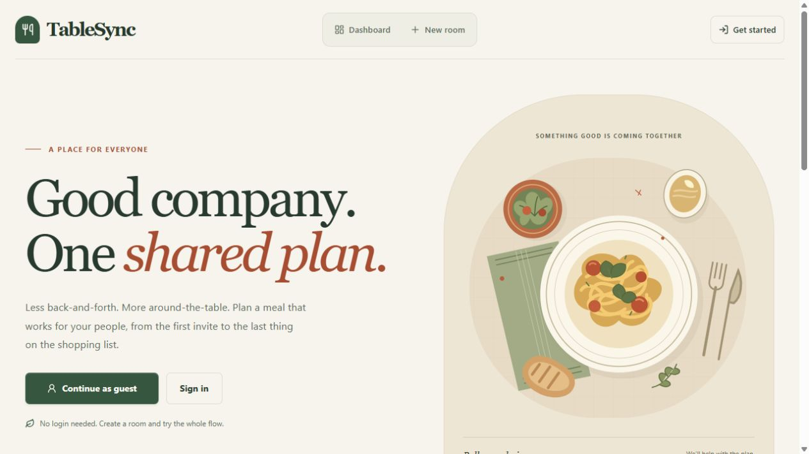
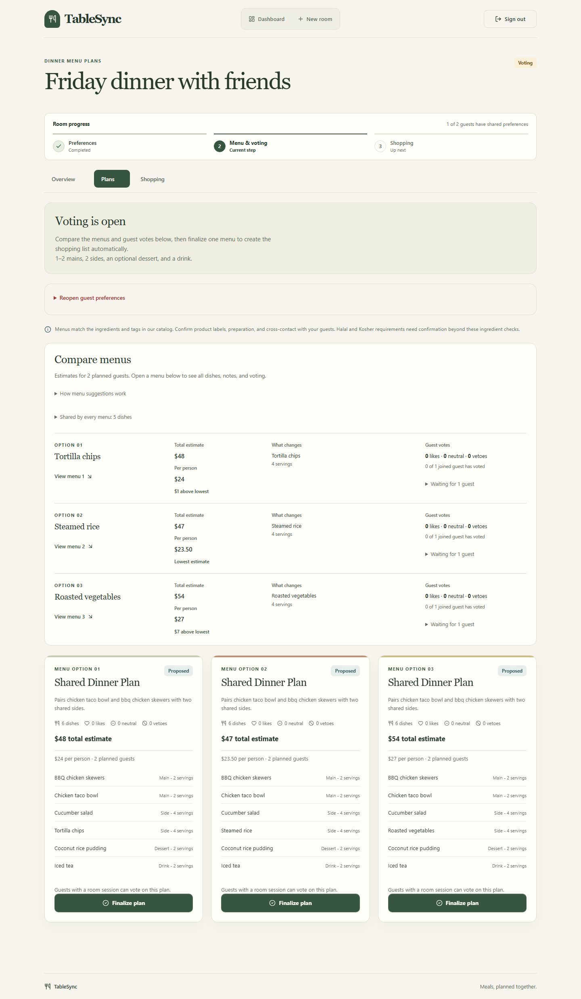
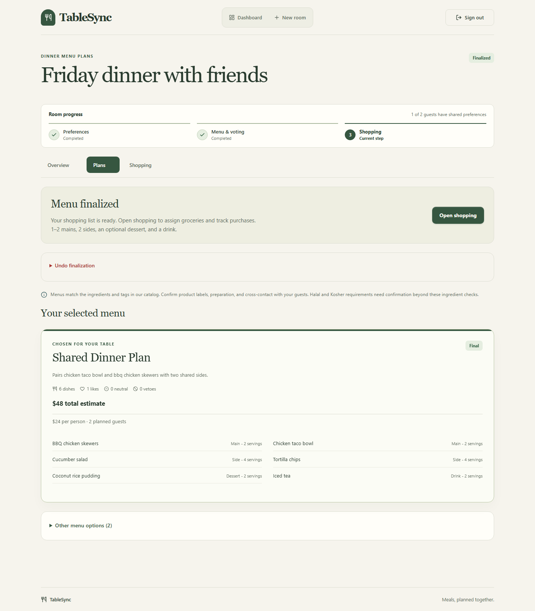

# TableSync

**Collaborative meal planning, from guest preferences to shared groceries.**

TableSync gives a group one place to plan a meal: collect dietary preferences, compare complete menus, agree on a favorite, and divide up the shopping. Built with Next.js, TypeScript, and PostgreSQL, it connects the decisions people make before a gathering with the work needed to make it happen.

**[Live demo](https://tablesync-staging.vercel.app)** · [Features](#features) · [Engineering](#engineering) · [Getting started](#getting-started) · [Documentation](docs/README.md)



## From invitation to dinner

1. **Create a gathering.** Choose a meal format, guest count, and optional group budget. Start as a guest; GitHub sign-in is optional.
2. **Bring everyone into the plan.** Share an invite link so guests can add preferences, allergies, and whether they can bring groceries.
3. **Decide together.** Generate up to three complete menus, compare portions and estimated costs, and vote with Like, Neutral, or Veto.
4. **Make it happen.** Finalize a menu, review preparation details, and track shared groceries or whole-dish Potluck contributions.

Supports **Dinner, Hotpot, Potluck, BBQ, Picnic, Brunch, and Other** for a shared buffet. Each format has its own menu structure.

## Features

| Feature | What it does |
| --- | --- |
| **Guest access and private rooms** | Create a room without a GitHub account. Optionally connect GitHub to return to your rooms across devices. |
| **Shared meal preferences** | Collect diets, allergies, likes, dislikes, spice tolerance, and willingness to bring groceries through a room invite. |
| **Constraint-based menu planning** | Build menus from a curated recipe catalog using guest coverage, meal-format rules, preferences, and the room's estimated budget. Explain conflicts when no suitable plan can be found. |
| **Menu comparison and voting** | See which dishes change, compare total and per-person estimates, and collect votes. Vetoes require a reason so the host can understand objections. |
| **Preparation and shopping** | Review finalized portions, ingredient quantities, estimated preparation times, and adjustment notes. Consolidate groceries, assign shoppers, and track purchases. |
| **Potluck coordination** | Claim whole dishes and mark them ready. Shared groceries adjust as contributions change while preserving unaffected shopping progress. |
| **Shared updates and public menus** | Keep active room views updated while protecting unsaved drafts. Optionally share a read-only finalized menu. |
| **Responsive interactions** | Use the workflow on desktop or mobile, with clear progress, pending states, retry controls, and reduced-motion support. |

## A look inside

<table>
  <tr>
    <th width="50%">Compare complete menus</th>
    <th width="50%">Turn a decision into a plan</th>
  </tr>
  <tr>
    <td valign="top">
      <a href="docs/evidence/ui/simple-menu-comparison-desktop.png"></a>
    </td>
    <td valign="top">
      <a href="docs/evidence/ui/selected-menu-desktop.png"></a>
    </td>
  </tr>
  <tr>
    <td>Compare the differences that matter before choosing a menu.</td>
    <td>Keep the selected menu in focus and move directly to shared shopping.</td>
  </tr>
</table>

The homepage capture is from the live demo. Planning screenshots show sample meal data; select an image to view it at full size.

## Engineering

The application separates meal-planning logic from presentation and persistence so its rules can be tested independently.

- **Explainable recommendations.** The [menu engine](src/lib/menu-engine/) separates constraint checks from preference scoring and format-specific menu assembly. It produces deterministic, catalog-based results without an external AI API.
- **Consistent workflow transitions.** A [state machine](src/lib/workflow/state-machine.ts) defines when preferences, voting, finalization, and shopping are available. [Database transactions and room locks](src/lib/store.ts) coordinate concurrent mutations.
- **Room-scoped authorization.** Better Auth manages host accounts. Separate [guest sessions](src/lib/guest-session.ts) use hashed tokens and HttpOnly cookies, with expiry and revocation, to scope participant access to each room.
- **Updates that preserve input.** Visible pages [poll room revisions](src/components/rooms/room-sync.tsx) every eight seconds. Refreshes account for drafts and pending submissions, with backoff and retry after failures.
- **Shopping reconciliation.** The [shopping engine](src/lib/shopping-engine/) scales and merges ingredients, balances assignments, and preserves covered purchases after Potluck changes. Increased quantities require a fresh purchase check.

### Tech stack

| Layer | Technologies |
| --- | --- |
| Application | Next.js 16 App Router, React 19, TypeScript, Server Components and Server Actions |
| Data and validation | PostgreSQL, Prisma 7, Zod |
| Authentication | Better Auth anonymous accounts and optional GitHub OAuth |
| Interface | Custom CSS, Lucide icons, responsive layouts |
| Verification | Vitest, Playwright, Axe, Lighthouse, GitHub Actions |

See the [development guide](docs/development.md#architecture) for the source layout and implementation details.

## Getting started

Use **Node.js 24.19.0** and **npm 11.17.0**, as pinned in the repository.

```bash
git clone https://github.com/pljf/TableSync.git
cd TableSync
npm ci
npm run db:dev
```

Keep the database terminal open. In a second terminal, create your local environment file:

```powershell
Copy-Item .env.example .env
```

On macOS or Linux, use `cp .env.example .env`.

Run `npx prisma dev ls` and copy the displayed TCP PostgreSQL URL into `DATABASE_URL` in `.env`. Set `BETTER_AUTH_SECRET` to at least 32 random characters. Leave both GitHub credential fields empty for guest-only access.

```bash
npm run db:deploy
npm run db:seed
npm run dev
```

Open [localhost:3000](http://localhost:3000) and choose **Continue as guest**. The seed adds the ingredient and dish catalog; create your first room through the app.

The bundled local database supports one active database-using app or test process at a time. Use the [development guide](docs/development.md) for environment settings, migrations, and recovery instructions.

## Testing

Unit tests cover planning rules and application behavior; PostgreSQL integration tests exercise persistence, authorization, and concurrent updates. Playwright covers browser workflows across Chromium, Firefox, and WebKit, with accessibility and responsive-layout checks.

```bash
npm run lint
npm run typecheck
npm run test
npm run test:db
npm run build
npm run test:e2e
```

Stop the development server before database and browser tests against the bundled local database. Run commands sequentially. Lighthouse audits are available through `npm run audit:performance`; the [CI workflow](.github/workflows/ci.yml) defines the automated repository checks.

## Usage notes

Rooms expire **seven days after creation**, including rooms linked to GitHub. Hosts can delete them sooner, and scheduled cleanup removes expired records. Anonymous host access belongs to the current browser; clearing cookies or ending that session removes access unless the account has been linked to GitHub.

Menu costs are estimates. Individual spending caps and complete religious-diet certification are not implemented. See the [user guide](docs/user-guide.md) for account behavior and the [room retention guide](docs/deployment/room-retention.md) for expiry and cleanup timing.

## Documentation

- [Documentation index](docs/README.md) — all guides and supporting material.
- [User guide](docs/user-guide.md) — preferences, voting, shopping, and Potluck contributions.
- [Development guide](docs/development.md) — setup, environment variables, commands, and architecture.
- [Deployment operations](docs/deployment/STAGING_OPERATIONS_RUNBOOK.md) — managed database configuration, staging acceptance, and recovery.
- [Meal-format specification](docs/product/EVENT_FORMAT_EXPANSION.md) — menu structures and contribution rules.

Development logs, original plans, and dated reviews are organized in the [documentation archive](docs/archive/README.md).
